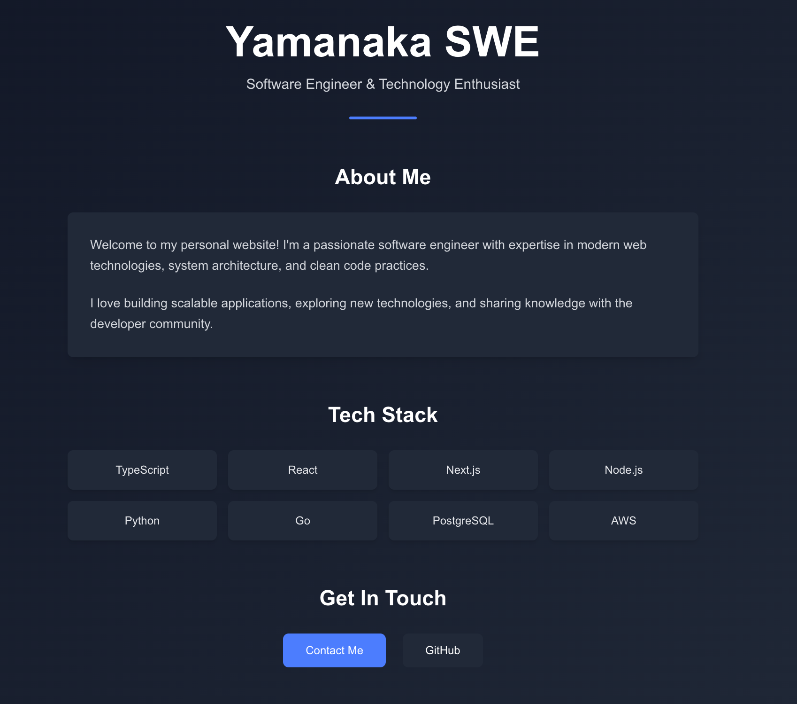

これは [`create-next-app`](https://nextjs.org/docs/app/api-reference/cli/create-next-app) でブートストラップされた [Next.js](https://nextjs.org) プロジェクトです。



## プロジェクトセットアップ

このプロジェクトは以下のコマンドで作成されました：

```bash
npx create-next-app@latest . --typescript --tailwind --eslint --app --src-dir --import-alias "@/*"
```

含まれる機能：
- TypeScript設定
- スタイリング用Tailwind CSS
- コードリンティング用ESLint
- srcディレクトリ構造のApp Router
- 開発用Turbopackを有効化

## はじめに

まず、開発サーバーを起動します：

```bash
npm run dev
# または
yarn dev
# または
pnpm dev
# または
bun dev
```

ブラウザで [http://localhost:3000](http://localhost:3000) を開いて結果を確認してください。

`app/page.tsx` を変更することでページの編集を開始できます。ファイルを編集すると、ページが自動的に更新されます。

このプロジェクトは [`next/font`](https://nextjs.org/docs/app/building-your-application/optimizing/fonts) を使用して、Vercelの新しいフォントファミリーである [Geist](https://vercel.com/font) を自動的に最適化・読み込みします。

## 詳細を学ぶ

Next.jsについて詳しく学ぶには、以下のリソースをご覧ください：

- [Next.js Documentation](https://nextjs.org/docs) - Next.jsの機能とAPIについて学べます。
- [Learn Next.js](https://nextjs.org/learn) - インタラクティブなNext.jsチュートリアル。

[Next.js GitHubリポジトリ](https://github.com/vercel/next.js)もチェックしてください - フィードバックやコントリビューションを歓迎しています！

## Vercelでのデプロイ

Next.jsアプリをデプロイする最も簡単な方法は、Next.jsの作成者による [Vercel Platform](https://vercel.com/new?utm_medium=default-template&filter=next.js&utm_source=create-next-app&utm_campaign=create-next-app-readme) を使用することです。

詳細については、[Next.jsデプロイメントドキュメント](https://nextjs.org/docs/app/building-your-application/deploying) をご確認ください。
